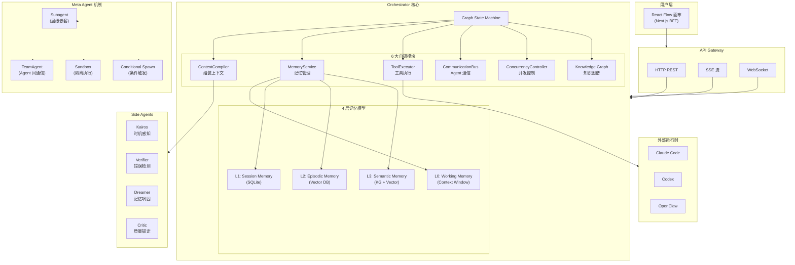
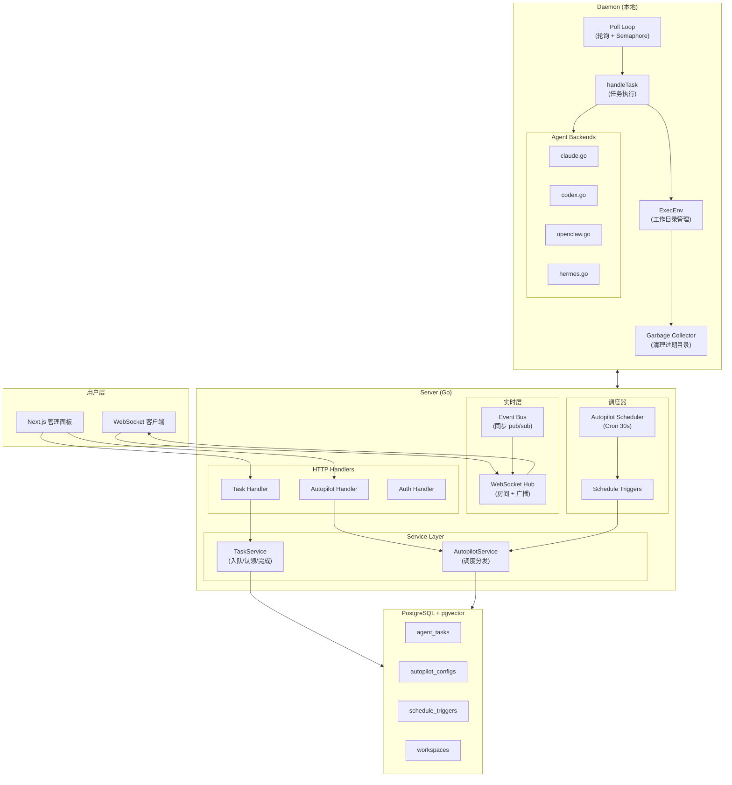
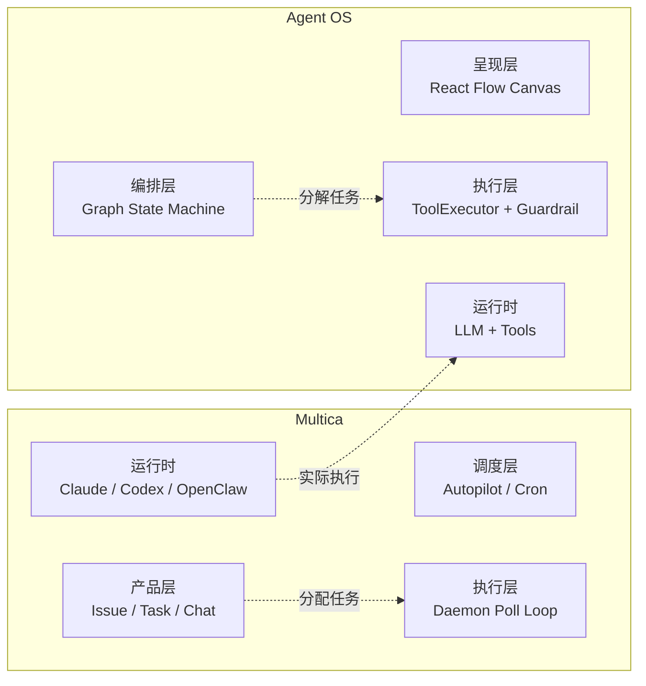
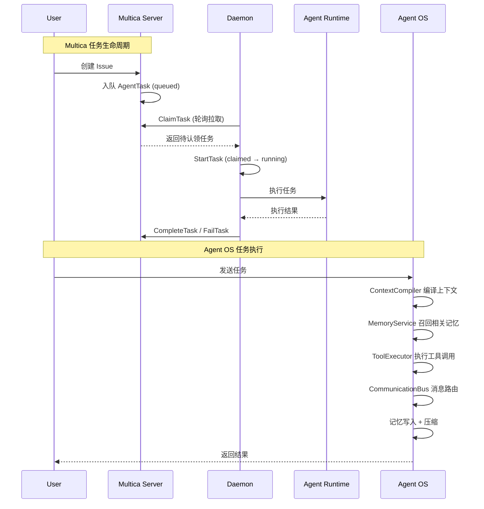
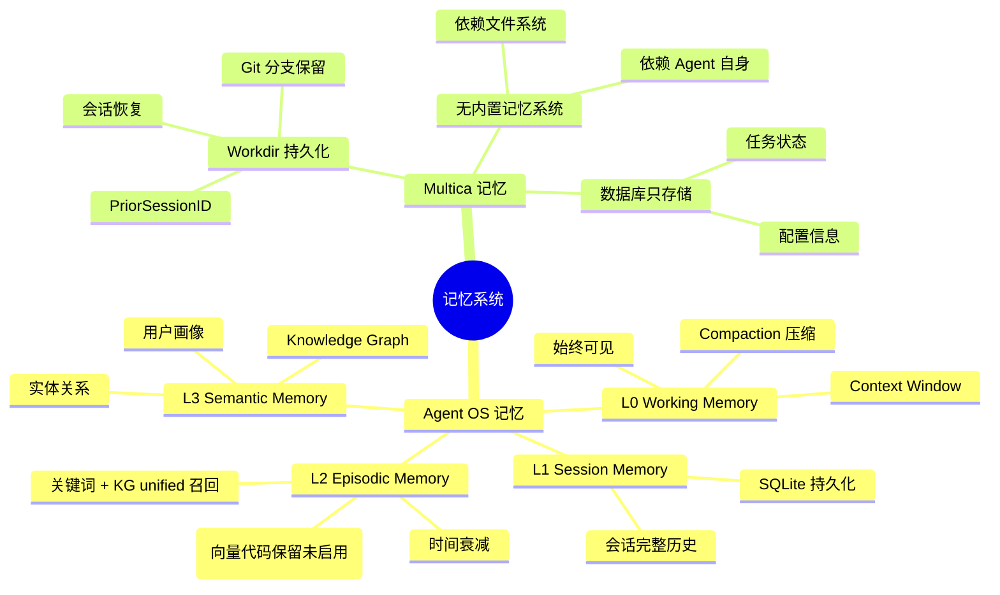
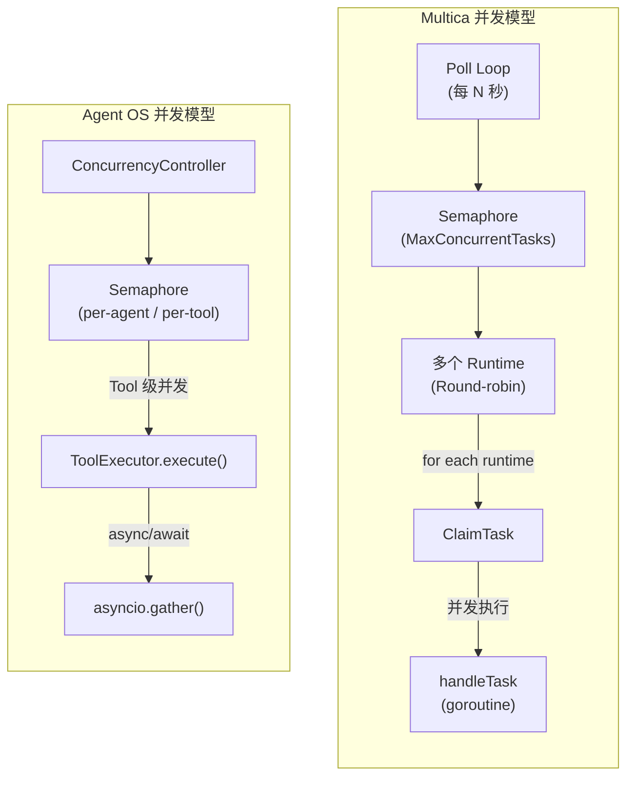

# Agent OS vs Multica 架构对比

> 分析日期: 2026-04-20
> 参考资料: `docs/architecture.md`, `RESEARCH-multica-analysis.md`

---

## 架构对比分析

### 关键差异

| 维度 | Agent OS | Multica |
|------|----------|---------|
| **架构层次** | 图状态机 + 6 大自研模块 | Server → Daemon → Agent 三层 |
| **核心抽象** | ContextCompiler, MemoryService, ToolExecutor | Task Service, Poll Loop, Backend Interface |
| **记忆系统** | 四层记忆模型（Working/Session/Episodic/Semantic）| 无内置记忆，依赖 workdir 持久化 |
| **编排模式** | Flow/DAG/Loop/Cron + Meta Agent 动态选择 | 任务拉取 + Cron 定时触发 |
| **并发控制** | Semaphore + ConcurrencyController | Poll Loop + Semaphore 信号量 |
| **通信模型** | CommunicationBus（内存总线）| HTTP 轮询 + WebSocket 广播 |
| **Agent 定位** | 基础设施层（平台视角）| 产品层（把 Agent 当员工管）|
| **生命周期** | 消息级状态机 | Server 管理的任务状态流转 |
| **前端** | React Flow 可视化画布 | Next.js + 协作面板 |
| **蝴蝶模型** | 正向翼/反向翼双向联想 | 无 |

### 核心相似点

| 相似点 | 说明 |
|--------|------|
| **多 Agent 并发** | 都支持多 Agent 并行执行 |
| **任务优先级** | 都有任务优先级机制 |
| **事件总线** | Multica 同步 pub/sub，Agent OS 有 CommunicationBus |
| **生命周期管理** | 都关心 Agent/任务的生命周期 |
| **Cron 调度** | 都支持定时触发机制 |
| **WebSocket/SSE** | 都支持实时推送 |
| **React Flow** | 都用 React Flow 作为前端可视化层 |

### 两个系统的定位关系

```
┌──────────────────────────────────────────────────────────────────┐
│                        用户 / 开发者                              │
└──────────────────────────────────────────────────────────────────┘
                              │
         ┌────────────────────┴────────────────────┐
         ▼                                         ▼
┌─────────────────────┐                   ┌─────────────────────┐
│      Multica        │                   │     Agent OS         │
│                     │                   │                     │
│  「谁来做这个任务」    │                   │  「任务内部如何执行」  │
│                     │                   │                     │
│  • 任务分配           │                   │  • Context 编译      │
│  • 员工管理           │                   │  • 记忆管理          │
│  • 进度追踪           │                   │  • 工具执行          │
│  • 实时协作           │                   │  • Agent 通信        │
│                     │                   │  • 并发控制          │
└─────────────────────┘                   └─────────────────────┘
         │                                         │
         │    ┌─────────────────────────────────────┘
         ▼    ▼
┌──────────────────────────────────────────────────────────────────┐
│                     实际执行层 (Claude Code 等)                      │
└──────────────────────────────────────────────────────────────────┘
```

**定位解读**：
- **Multica** 解决「**任务从哪里来、分配给谁、结果如何追踪**」— 工作流编排
- **Agent OS** 解决「**一个任务进来后，Agent 如何理解、分解、执行、记忆**」— 执行引擎编排
- 两者是**正交的**：Multica 负责「谁执行」，Agent OS 负责「如何执行」

---

## Mermaid 架构图

### 图 1: Agent OS 核心架构



### 图 2: Multica 核心架构



### 图 3: 架构层次对比



---

### 图 4: 任务生命周期对比



### 图 5: 记忆系统对比



---

### 图 6: 并发模型对比



---

## 主流记忆系统对比（P4 补齐,2026-06-20）

> 引用记忆研究报告第七、八章结论。补充 hermes-agent / Letta / Mem0 / Zep 对比,凸显 agent-os-v2 差异化优势。

| 维度 | agent-os-v2 | hermes-agent | Letta | Mem0 | Zep |
|------|-------------|--------------|-------|------|-----|
| **记忆分层** | 四层(Working/Session/Episodic/Semantic)+ 状态机(P3) | provider 总线,无分层 | core memory blocks + archival | 事实/偏好自动提取 | 时间感知 graph + 向量 |
| **召回** | 关键词 + KG unified(向量代码保留未启用) | provider prefetch | 检索 + blocks | 向量 + LLM 提取 | Graphiti 时间图谱 |
| **巩固** | Dreamer(离线 L2→L3)+ TaskConsolidator(任务后在线)+ 状态机 | sync_all 后台单 worker | agent 自管理 | 自动 fact extraction | 自动 episodic → semantic |
| **产权边界** | origin(FOREGROUND/AGENT)保护用户记忆(P0) | skill_provenance | 无 | 无 | 无 |
| **事件解耦** | MemoryEventBus 6 钩子(P1) | MemoryManager 6 钩子 | 无 | 无 | 无 |
| **cache** | compiler 三层 + Anthropic cache_control(P2) | prompt_caching system_and_3 | 无 | 无 | 无 |

**agent-os-v2 四优势**(研究报告第八章 8.5,P0-P3 严守红线未推倒):🦋 蝴蝶翼双向联想 / 🛡️ 信任域 5 级权限 / 📊 五维评分(recency/frequency/relevance/emotional/actionable)/ 🔍 语义召回三模式。

## FAISS 真相校准（P4,2026-06-20）

文档早期(D-12/D-27)声明"已移除 FAISS",但代码(`vector.py` + `embedding.py`,all-MiniLM-L6-v2)仍存在。**真相:运行时未启用** —— `MemoryService` 传 `vector_store=None`,召回走关键词 + KG unified(`service.py` docstring 已校准)。FAISS 代码保留为 V2 pgvector 预留,不强启用(详见 TD-007)。

## 总结

| 维度 | Agent OS | Multica | 关系 |
|------|----------|---------|------|
| **职责** | Agent 执行引擎 | Agent 协作平台 | 正交互补 |
| **记忆** | 四层内存模型 | Workdir 持久化 | Agent OS 更系统化 |
| **编排** | Flow/DAG/Loop/Cron | Task Claim 拉取 | Agent OS 更灵活 |
| **扩展性** | 模块化自研 | Backend 接口抽象 | 两者都强调可扩展 |
| **适用场景** | 单 Agent 深度任务执行 | 多 Agent 协作管理 | 可以叠加使用 |

**关键洞察**：Multica 和 Agent OS 是**正交的**两个层次 — Multica 回答「**谁来执行**」，Agent OS 回答「**如何执行**」。未来可能的设计是：Multica 作为任务管理层，调用 Agent OS 作为执行引擎。
