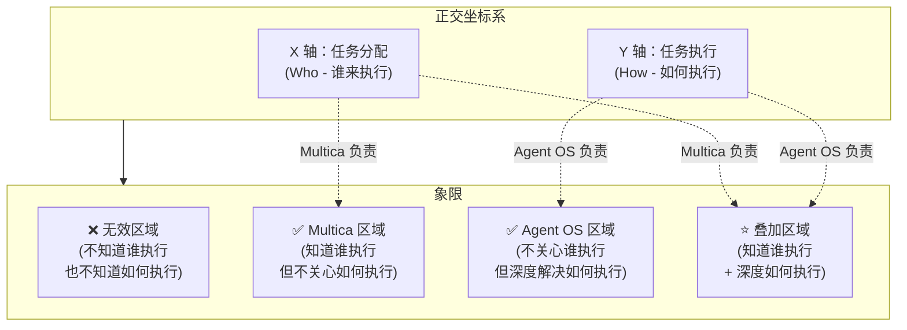
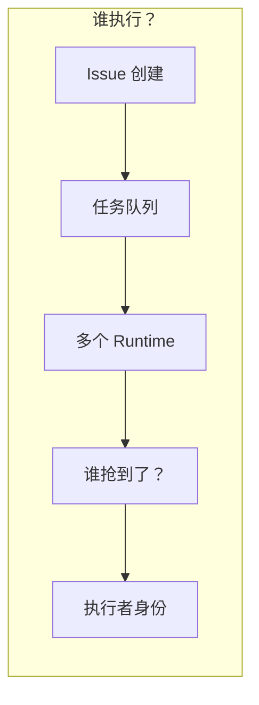
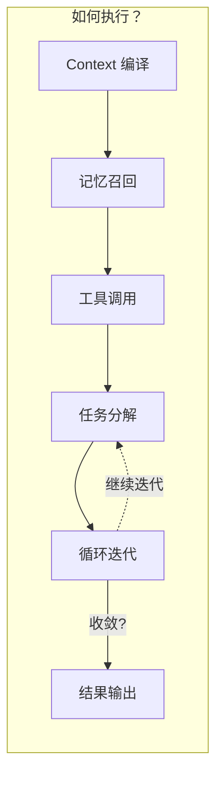
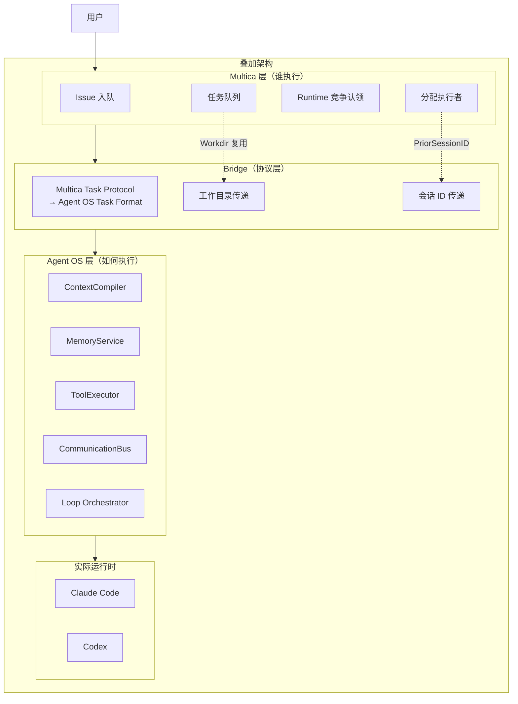
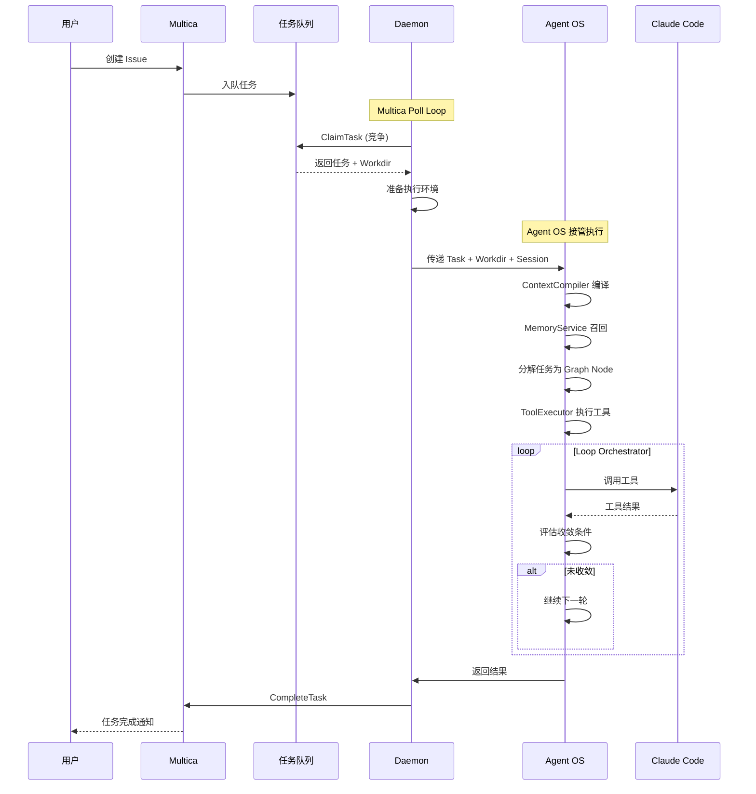
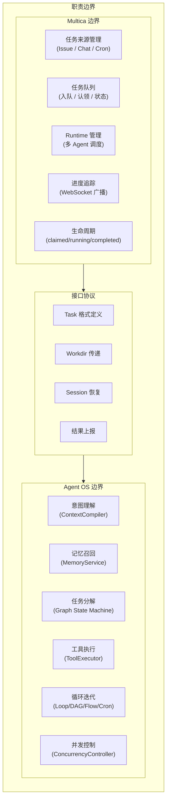

# Agent OS 与 Multica：编排维度正交性分析

> 分析日期: 2026-04-20
> 参考资料: `docs/architecture.md`, `RESEARCH-multica-analysis.md`

---

## 核心论点

**Multica 管「谁执行」，Agent OS 管「如何执行」** — 两者在编排维度上完全正交，可以叠加使用。

---

## 正交性图解



---

## 「谁执行」vs「如何执行」分离

### Multica 回答「谁执行」



**Multica 的职责**：
1. 接收 Issue / Chat / Cron 触发
2. 入队到任务队列
3. 多个 Runtime（Claude Code / Codex / OpenClaw 等）竞争认领
4. 分配执行者身份

**关键问题**：「这个任务分配给哪个 Agent？它的状态如何？」

---

### Agent OS 回答「如何执行」



**Agent OS 的职责**：
1. 理解任务意图（ContextCompiler）
2. 召回相关记忆（MemoryService）
3. 分解为可执行步骤（Graph State Machine）
4. 调用工具执行（ToolExecutor）
5. 迭代直到收敛（Loop Orchestrator）
6. 记忆写入（MemoryService）

**关键问题**：「任务进来后，Agent 如何理解、分解、执行、记忆？」

---

## 叠加架构

当 Multica 和 Agent OS 叠加时：



### 叠加流程



---

## 职责边界清晰划分



| 职责 | Multica | Agent OS |
|------|---------|----------|
| 任务来源 | ✅ | ❌ |
| 任务队列 | ✅ | ❌ |
| Agent 调度 | ✅ | ❌ |
| 进度追踪 | ✅ | ❌ |
| 意图理解 | ❌ | ✅ |
| 记忆管理 | ❌ | ✅ |
| 任务分解 | ❌ | ✅ |
| 工具执行 | ❌ | ✅ |
| 循环迭代 | ❌ | ✅ |
| 并发控制 | ❌ | ✅ |

---

## 正交性验证

### 维度 1: 问题空间正交

- **Multica** 在**组织维度**提问：在多 Agent 系统中，任务如何分配？
- **Agent OS** 在**单 Agent 维度**提问：在单个 Agent 内部，任务如何执行？

### 维度 2: 抽象层次正交

- **Multica** 是**产品层抽象**：任务 = Issue / Task / 完成状态
- **Agent OS** 是**引擎层抽象**：任务 = Context + Memory + Tool Call Graph

### 维度 3: 可独立演进

- **Multica** 可以使用任何「如何执行」的引擎（不仅是 Agent OS）
- **Agent OS** 可以接受任何「谁来执行」的输入（不仅是 Multica）

---

## 设计启示

### 当前状态

```
Multica 单独使用：任务管理强大，但执行深度依赖 Agent 自身能力
Agent OS 单独使用：执行引擎强大，但任务来源需要自己实现
```

### 理想状态

```
Multica（任务管理层）+ Agent OS（执行引擎层）= 完整的 Agent 工作流平台
```

### 具体借鉴

| 借鉴点 | 来源 | 应用到 Agent OS |
|--------|------|----------------|
| Workdir 复用 | Multica | Agent 级别上下文持久化 |
| Session 恢复 | Multica | PriorSessionID 机制 |
| Backend 接口抽象 | Multica | 统一 LLM Provider 接口 |
| Autopilot 两种模式 | Multica | 任务是否走完整 Issue 链路 |

---

## 结论

**Multica 和 Agent OS 是正交的两个编排维度**：

1. **Multica** = 任务管理层（谁执行）
2. **Agent OS** = 执行引擎层（如何执行）
3. 两者叠加 = 完整的 Agent 工作流平台

这不是竞争关系，而是**互补关系**。未来 Agent OS 可以作为 Multica 的执行引擎后端，同时保留自己的完整功能。
