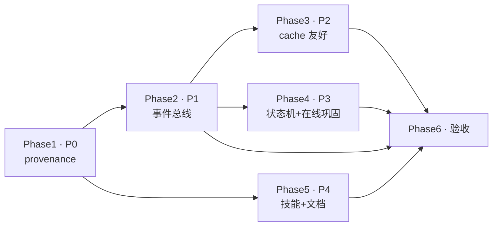

# agent-os-v2 记忆系统迭代计划(P0–P4)

> **版本**:v1 · 2026-06-19
> **来源**:基于《Agent 编排 / Agent OS 外部持久记忆存储研究》报告**第七章**(Harness 接入框架 L0–L5)、**第八章**(agent-os-v2 vs hermes 对比)的互鉴结论,经 **5 路并行代码勘察 + 综合研判**产出(ultracode workflow `wf_a8a68ef6-62f`,6 agent / 287k tokens)。
> **主线**:先堵风险(P0 provenance)→ 再解耦(P1 事件总线)→ 后加速能力(P2 cache / P3 巩固 / P4 技能),全程不推倒现有优势。
> **对标**:hermes-agent(L4 工业范本,`~/tools/hermes-agent`)。
> **预估总工期**:~11 周(6 阶段,M1–M6 六个里程碑)。

---

## 〇、红线:必须保护的四项现有优势

本计划**严禁推倒** agent-os-v2 已有的记忆智能优势(详见研究报告第八章 8.5)。Phase 6 强制回归测试:

| 优势 | 位置 | 保护措施 |
|---|---|---|
| 🦋 蝴蝶翼双向联想 | `memory/butterfly_wing.py` | 不改其数据结构与召回策略 |
| 🛡️ 信任域 5 级权限 | `memory/permissions.py` | origin 字段不绕过权限层 |
| 📊 五维评分 | `memory/scorer.py` | 状态机与评分协同,不替换评分 |
| 🔍 语义召回三模式 | `memory/_recall/` | FAISS 仅文档化,不强启用 |

---

## 一、总览

### 主线编排

```
P0 provenance(堵风险)→ P1 事件总线(解耦)→ ┌ P2 cache 友好
                                          ├ P3 巩固/状态机   → P6 交叉验收
                                          └ P4 技能/文档(可并行)
```

### 依赖图



### 阶段矩阵

| Phase | 优先级 | 目标一句话 | 工作量 | 依赖 | 抄 hermes 的什么 |
|---|---|---|---|---|---|
| 1 | **P0** | origin provenance 产权边界 | M(~4d) | 无 | `skill_provenance` |
| 2 | **P1** | MemoryEventBus + Hook 解耦 | M(~6.5d) | P0 | `MemoryManager` |
| 3 | **P2** | 三层 messages + cache_control | M(~5d) | P1 | `_cached_system_prompt` 死磕 |
| 4 | **P3** | 确定性状态机 + 在线巩固 | M(~6d) | P1 | `curator`(active/stale/archived)+ `background_review` |
| 5 | **P4** | agentskills.io 对齐 + 文档同步 | S(~2d) | 无(可并行) | agentskills.io 标准 |
| 6 | P2 | 交叉验收 + 回滚基线 | S-M(~2-3d) | 1–5 | — |

---

## 二、Phase 1 — P0 provenance 产权边界【最高优先】

**目标**:给 MemoryItem 加 `origin` 字段(`FOREGROUND`=用户/系统录入 vs `AGENT`=agent 自沉淀),所有自动巩固路径(forgetting / reflect / migrator / dreamer)仅处理 `origin=AGENT`,**彻底堵住 DreamerAgent 无差别乱改用户记忆的风险**。默认值保护用户记忆(FOREGROUND)。

**现状**:`types.py:69-99` 的 MemoryItem 无 origin 字段;`metadata` 已被迁移追踪(`migrated_from`/`consolidation_trigger`)和遗忘保护(`safety_deadline`/`forget_score`)占用,**不宜混入**;所有巩固路径当前未过滤来源——这是报告第八章 8.6 风险点 1。

**任务(文件级)**:

| 文件 | 改动 |
|---|---|
| `memory/types.py` | 新增 `MemoryOrigin(str, Enum) = "foreground" \| "agent"`;MemoryItem 加 `origin: MemoryOrigin = FOREGROUND`;MemoryFilter 加 `origin` 过滤条件 |
| `memory/pgstore.py`(:42-53) | `memory_items` 表加 `origin TEXT DEFAULT 'foreground'` 列;`_row_to_memory_item` 映射;Alembic upgrade + downgrade |
| `memory/sqlitestore.py`(:63-76) | `memories` 表加 origin 列;ALTER TABLE 迁移脚本 |
| `memory/store.py` | `_matches_filter` 加 origin 过滤逻辑 |
| `memory/_crud.py`(:31-62) | `store()` 加 `origin` 参数透传(默认 FOREGROUND) |
| `memory/service.py`(:112-131) | `store()` facade 加 origin 透传 |
| `memory/forgetting.py`(:64-160) | `run_sweep()` 的 recall 加 `origin=AGENT` 过滤 |
| `memory/migrator.py`(:101-138 / 156-199 / 241-317) | 三个 Migrator(Working→Session / Session→Episodic / Episodic→Semantic)的 store 调用设 `origin=AGENT` |
| `memory/_session.py`(:43-130) | `reflect()` 的 recall 加 `origin=AGENT` 过滤,仅合并 agent 来源的 EPISODIC |
| `memory/sideline/dreamer.py`(:93-121) | `consolidate_session()` 确认 reflect 内部正确设 origin=AGENT |
| **新增** | 集成测试:验证巩固路径仅处理 AGENT,FOREGROUND 不被遗忘/合并/迁移 |

**工作量**:M,~3.5-4 人天(类型层 0.5d + 三 store schema 迁移 1d + 五巩固路径过滤透传 1d + 测试 1d)。纯增量字段 + 过滤逻辑,无大型新模块。

**验收**:
- [ ] MemoryItem 新增 `origin`,默认 FOREGROUND
- [ ] pgstore / sqlitestore / inmemory 三种 store schema 均加 origin 列,历史数据默认 FOREGROUND
- [ ] forgetting / reflect / migrator / dreamer 仅处理 `origin=AGENT`,集成测试验证
- [ ] 外部 `memory_service.store()` 可显式指定 origin(默认 FOREGROUND 向后兼容)
- [ ] 数据库迁移(Alembic / ALTER TABLE)通过,支持 downgrade 回滚
- [ ] 集成测试:agent 自沉淀记忆能被巩固,用户录入记忆永不被遗忘/合并

**依赖**:无,**可独立先行**。

**里程碑 M1**(~第 2 周):Dreamer 不再碰用户记忆,可演示。

---

## 三、Phase 2 — P1 事件总线解耦

**目标**:建立 `MemoryEventBus` + `MemoryHook` 体系,把 `chat.py` 中 **10+ 处**直接 memory 调用和 `compiler.compile` 中的 `manager.select` 抽象为统一事件生命周期(`turn_start` / `turn_end` / `session_end` / `pre_compress` / `delegate`)。实现 `DefaultMemoryHook` 封装现有逻辑,主流程改为 emit 事件——**为 P2/P3 提供干净的插入点,是它们的结构前提**。

**现状(chat.py 直接调用点)**:
- L129 `migrate_working_to_session()` · L144/177 `recall()` · L149/183/233/370 `store()` · L163/195 `update()` · L379 `migrate_session_to_episodic()` · L410 `create_session()`
- `compiler.py:62-77` 每轮 `manager.select()` 召回注入
- 已有基础设施:`_state.emit_memory_event`/`subscribe_memory_events`(SSE)、`CommunicationBus`、`GraphState.on_node_complete`(可复用)

**任务(文件级)**:

| 文件 | 改动 |
|---|---|
| **新建** `memory/event_bus.py` | `MemoryEventBus`(基于 CommunicationBus 模式);事件类型 `TurnStart/TurnEnd/SessionEnd/PreCompress/DelegateEvent`;支持优先级 + 依赖管理 |
| **新建** `memory/hooks.py` | `MemoryHook` 抽象基类 + 上下文类型(`TurnContext`/`SessionContext`/`CompressContext`/`DelegateContext`/`CompressDecision`) |
| **新建** `memory/default_hook.py` | `DefaultMemoryHook` 封装现有逻辑:on_turn_end 做 migrate_working_to_session + 压缩检查;on_session_end 做 migrate_session_to_episodic;on_pre_compress 封装压缩决策 |
| `api/routes/chat.py` | 移除 L129/144/149/163/177/183/195/233/370/379/410 直接调用 → `await memory_bus.emit(...)` |
| `context/compiler.py`(:56-88) | compile 中触发 `pre_compress` 事件,替换 L62-77 直接 `manager.select` |
| `services/_state.py` | 加 `memory_event_bus` / `memory_hook` 单例;SSE 与内部 MemoryEvent 解耦 |
| `engine.py` | startup 注册 DefaultMemoryHook;**提供降级开关**(可跳过总线直接调原逻辑) |
| **新增** | hook 单元测试:每个 hook 独立可测,压缩逻辑可脱离图执行单测 |

**工作量**:M,~6.5 人天(event_bus+hooks+default_hook 2d + chat.py 10+ 处重构 2d + compiler 接入+engine 注册+降级开关 1d + 集成测试重设计 1.5d)。改造面广但风险可控:**分三步**——先建总线保持旧调用 → 逐步迁移调用点 → 最后移旧码。

**验收**:
- [ ] chat.py 所有直接 memory_service/memory_migrator 调用已移除,替换为事件触发
- [ ] MemoryEventBus 支持订阅 TurnStart/TurnEnd/SessionEnd/PreCompress/Delegate
- [ ] MemoryHook 接口清晰(on_turn_start/end、on_session_end、on_pre_compress、on_delegate)
- [ ] DefaultMemoryHook 正确封装现有迁移与压缩逻辑,现有测试全过
- [ ] 可配置注册多个 hook(AuditHook、MetricsHook)不影响主流程
- [ ] 压缩逻辑可独立单测,无需模拟整个图执行
- [ ] 事件总线支持优先级和依赖管理,确保迁移在压缩前完成
- [ ] 现有 SSE 机制不变,内部总线与 SSE 推送解耦
- [ ] 提供降级配置,可回退直接调用模式

**依赖**:Phase 1(P0)完成——origin 字段先就位,事件总线封装时可直接在 hook 内携带 origin 语义;且 P0 已收紧巩固路径,降低解耦重构期的误改风险。

**里程碑 M2**(~第 5 周):记忆调用解耦,可发布。

---

## 四、Phase 3 — P2 Anthropic Prompt Cache 友好化

**目标**:解决 compiler 每轮重编译 system 段、memory block 破坏性插入、tool definitions 动态组装导致缓存失效的问题。将 messages 拆为**三层**(static_system 固定 prompt+tools / dynamic_context memory block / conversation 历史),在 AnthropicProvider 实现 `cache_control` 断点,使 base system+tools 跨会话稳定缓存。**仅在 Anthropic 通道生效,OpenAI/Zhipu 安全忽略。**

**现状(缓存破坏点)**:
- `compiler.py:56-88` 每轮重组装 messages,system 段含动态内容(memory block、tool defs)
- `compiler.py:73-76` 动态召回 memory 直接插 system 段,每次召回不同 → 整段缓存失效
- `compiler.py:79-87` tool definitions 每轮重新生成
- **关键约束**:`services/llm_client.py:23-38` 用 OpenAI 兼容 API,未实现 cache_control;**orchestrator 直连 OpenAI(base_url=api.openai.com),绕过 resource-manager 的 AnthropicProvider**——cache_control 无从生效,需先改调用路径

**任务(文件级)**:

| 文件 | 改动 |
|---|---|
| `context/compiler.py`(:56-88) | 拆 compile 为三层结构;新增 `cache_breakpoint` 参数;static_system(base prompt+tools)放最前,dynamic_context(memory block)单独分层;消除 L73-76 破坏性插入、L79-87 动态 tool 重组 |
| `context/manager.py` | 新增 `get_static_context()` 返回稳定的 system+tools 块,跨轮不变 |
| `services/llm_client.py` | 加 Anthropic cache_control 支持;区分 OpenAI/Anthropic 调用路径(当前绕过 resource-manager,需改 Anthropic 专用 endpoint 或走 resource-manager) |
| `resource-manager/src/providers/__init__.py` | 增强 `AnthropicProvider.complete()` 支持 cache_control(static_system 末 block 加 `{"type":"cache_control","cache_type":"persistent"}`;dynamic_context 用 ephemeral 或不缓存) |
| `api/routes/chat.py` | 调 compile 时传 `cache_breakpoint=True`;保留向后兼容(简单 chat 可选启用) |
| **新增** | 单测:相同 system+tools 跨会话复用缓存,仅 memory block 变动不重缓存 system 段;OpenAI/Zhipu 安全忽略 cache_control |

**目标消息结构**:
```
messages = [
  {system: base_system_prompt,  cache_control: persistent},  # 跨会话共享
  {system: tools_block,         cache_control: persistent},  # 跨会话共享
  ─── 缓存断点 ───
  {user:    memory_block},                                   # 每轮变动,不缓存
  {assistant/...: conversation_history},                     # 倒序截断
  {user:    current_input}
]
```

**工作量**:M,~5 人天(compiler 三层拆分 + get_static_context 1.5d + LLMClient Anthropic 路径 + provider cache_control 2d + chat.py 接入 0.5d + 测试 1d)。**难点在调用路径改造**(orchestrator 绕过 resource-manager)。

**验收**:
- [ ] `ContextCompiler.compile()` 支持 `cache_breakpoint` 参数,返回结构化三层 messages
- [ ] Anthropic 调用时 static_system 段自动加 cache_control 断点,动态 memory 段不缓存
- [ ] 单测:相同 system+tools 跨会话复用缓存,仅 memory block 变动不重缓存 system 段
- [ ] 非 Anthropic provider(OpenAI/Zhipu)不受影响,cache_control 安全忽略
- [ ] 现有 chat() API 行为不变,向后兼容

**依赖**:Phase 2(P1)完成——compiler.compile 已解耦到 pre_compress 事件路径,cache 改造才有干净插入点。

**里程碑 M3**(~第 7 周):Cache 命中可见,可演示(需给缓存命中率指标基线)。

---

## 五、Phase 4 — P3 确定性状态机 + 在线巩固补强

**目标**:引入确定性三态状态机(`ACTIVE`/`STALE`/`ARCHIVED`,30 天/90 天阈值,参照 hermes curator),改造 `ActiveForgetting` 从 boolean archived 升级为 state 流转;新增 `TaskConsolidationAgent` 实现任务后 background_review 式**在线巩固**(与 DreamerAgent 周期性离线巩固协同);向量召回保持现状(KG 为主),FAISS 代码保留但文档化。

**现状**:
- 离线巩固:DreamerAgent(`sideline/dreamer.py:21`,周期 3600s)调 reflect 把 EPISODIC 凝结为 SEMANTIC ✅
- 在线压缩:AsyncCompressor(70%)+ SyncCompressor(85%)——是 context 管理,**非任务后提炼** ❌
- **缺在线巩固**:无任务后 background_review 式经验沉淀
- 遗忘:`forgetting.py:36` 基于五维评分(阈值 0.1,最小年龄 24h),**无 active/stale/archived 三态,无 30/90 天阈值** ❌
- **FAISS 真相**:`vector.py` 实现完整 + `embedding.py`(all-MiniLM-L6-v2),但 `service.py:72` 传 `vector_store=None`、`__init__.py` 未导出 SemanticRecall → **运行时未启用,已切 KG**(unified = 关键词+KG)。D-12 文档声明"已完成移除"与代码不符。

**任务(文件级)**:

| 文件 | 改动 |
|---|---|
| `memory/types.py` | 新增 `MemoryState` 枚举(ACTIVE/STALE/ARCHIVED);MemoryItem 加 `state: MemoryState` + `last_state_transition: str` |
| **新建** `memory/state_pruner.py` | `TimeBasedStatePruner`:30 天无访问→STALE,90 天或低重要性→ARCHIVED;`StatePrunerConfig` 阈值配置化(初期保守);并发安全批量更新 |
| `memory/sqlitestore.py` + `pgstore.py` | 新增 state / last_state_transition 列,`ALTER TABLE ... DEFAULT 'ACTIVE'` 向后兼容 |
| `memory/forgetting.py`(:36/64-160) | 改造 `run_sweep()` 用 state 字段替代 boolean archived;扫描 STALE 批量归档;**集成 TimeBasedStatePruner 先于 LLM 巩固执行(零成本控膨胀)**;保留安全期机制 |
| **新建** `memory/sideline/task_consolidator.py` | `TaskConsolidationAgent`:任务后 LLM 提取关键决策/踩坑/工具模式;用 `BackwardWriter`(`sideline/backward_writer.py:42`)三通道(FAST/MEDIUM/SLOW)按置信度写回;`asyncio.create_task` 异步不阻塞,失败降级简单摘要,2s 超时 |
| `engine.py` | 注册 `Graph.on_finish` 回调触发 TaskConsolidationAgent;周期性调 TimeBasedStatePruner(每 24h);复用 Phase 2 的 on_session_end hook |
| `memory/service.py` | **保留现状**(vector_store=None,仅 KeywordRecall+KGRecall unified);文档化说明 FAISS 暂不启用,为 V2 pgvector 预留 |

**工作量**:M,~6 人天(types+state_pruner 1.5d + store 迁移 0.5d + forgetting 改造 1d + TaskConsolidationAgent+BackwardWriter 协同 1.5d + engine 接入 0.5d + 测试 1d)。

**验收**:
- [ ] MemoryState 枚举完整(ACTIVE/STALE/ARCHIVED),文档说明迁移条件
- [ ] TimeBasedStatePruner:30 天→STALE,90 天/低重要性→ARCHIVED,并发安全
- [ ] ActiveForgetting 用 state 字段,run_sweep() 扫 STALE 批量归档,保留安全期
- [ ] TaskConsolidationAgent 实现 task.on_finish 触发,经 BackwardWriter 三通道写回,异步不阻塞,失败降级
- [ ] Engine 集成:周期 pruner(24h)+ task 结束 consolidator
- [ ] 向量召回保持现状(KG 为主),FAISS 代码保留文档化,为 pgvector 预留

**依赖**:Phase 2(P1)完成——状态机和在线巩固通过 on_session_end/on_finish hook 注入;且 P0 的 origin 过滤确保 TaskConsolidationAgent 写回的 EPISODIC 被正确标注 AGENT,可被 DreamerAgent 后续提升。

**里程碑 M4**(~第 9 周):确定性膨胀控制,可发布。

---

## 六、Phase 5 — P4 技能对齐 agentskills.io + 文档同步

**目标**:更新 `tech-debt.md` / `implementation-roadmap.md` 纳入本次迭代;新增 TD-007(FAISS 声明与实现不一致)/ TD-008(架构对比覆盖不全)/ TD-009(skill bundle 未对齐 agentskills.io);新增迭代 10 子任务;FAISS 真相校准明确去留;补主流记忆系统对比。**纯文档+契约工作,可与主线并行。**

**现状**:`tech-debt.md` 仅 6 条低优先 TD,无文档代码不同步条目;`implementation-roadmap.md` 已记录迭代 1-9 + A-D,完成度标 97%,未纳入本次三个改造点。

**任务(文件级)**:

| 文件 | 改动 |
|---|---|
| `docs/tech-debt.md` | 新增 TD-007 / TD-008 / TD-009,标记 P2(约 30 行) |
| `docs/implementation-roadmap.md` | 新增**迭代 10「改造点对齐(2026-06)」**(约 50 行):10.1 agentskills.io 对齐 / 10.2 FAISS 决策校准 / 10.3 architecture-comparison 补齐;完成度 97%→98%,100% 目标纳入迭代 10 |
| `docs/implementation-roadmap.md` | 明确迭代 10 依赖(10.2 需先确认 FAISS 去留;10.3 可并行)+ 验收清单 |
| `docs/architecture.md` | D-28 章节引用 agentskills.io 对齐 |
| `docs/architecture-comparison.md` | **补齐主流记忆系统对照**(当前只比了 Multica,未比 hermes/Letta/Mem0/Zep)——可引用研究报告第七、八章结论;FAISS 真相校准(代码在但 `service.py:72` 未启用,已切 KG) |
| skill bundle 契约 | 对齐 agentskills.io 标准(SKILL.md + frontmatter),跨 agent 互通 |

**工作量**:S,~1.5-2 人天。不影响 P0-P1 阻塞性债务(TD 标 P2)。

**验收**:
- [ ] tech-debt.md 含 TD-007/008/009 且标 P2
- [ ] implementation-roadmap.md 含迭代 10,分解 10.1/10.2/10.3
- [ ] 迭代 10 明确依赖与验收清单
- [ ] 完成度更新 98%,100% 目标纳入
- [ ] architecture.md D-28 引用本次对齐
- [ ] FAISS 真相校准完成:代码保留但运行时未启用,KG 为主
- [ ] architecture-comparison.md 补齐主流记忆系统对比

**依赖**:无强依赖,**可在 Phase 1 完成后任意时点并行启动**(建议与 Phase 2/3/4 并行)。10.2 FAISS 决策需与 Phase 4 向量召回保留结论对齐。

**里程碑 M5**(~第 10 周):文档同步,可发布。

---

## 七、Phase 6 — 交叉验收与回滚基线

**目标**:收尾——验证全部阶段验收标准、补全降级开关、**回归四项现有优势未受损**;确认 P0 origin 过滤在事件总线(P1)、cache(P2)、状态机(P3)全链路一致生效;整理回滚基线。

**任务**:
- 端到端集成测试:`origin=FOREGROUND` 记忆在全链路(forgetting/reflect/migrator/dreamer/task_consolidator/state_pruner)均不被误改
- 回归测试:蝴蝶翼 / 信任域 / 五维评分 / 语义召回三模式行为未变
- 验证降级开关:P1 总线可回退直接调用;P2 cache_control 在非 Anthropic 通道安全忽略;P3 状态机阈值运行时可调
- 数据库 migration 端到端:PG Alembic upgrade/downgrade、SQLite ALTER TABLE 双向均通过;历史数据默认值(origin=FOREGROUND / state=ACTIVE)正确
- 整理回滚基线文档 + 部署 checklist

**工作量**:S-M,~2-3 人天。

**验收**:
- [ ] 全链路 origin 过滤一致生效(FOREGROUND 记忆全程不被误改)
- [ ] 四项优势(蝴蝶翼/信任域/五维评分/三模式召回)回归测试全过
- [ ] 所有降级开关可用,P1/P2/P3 均支持回退
- [ ] 数据库 migration 双向(upgrade/downgrade)验证通过
- [ ] 回滚基线文档与部署 checklist 完成

**依赖**:Phase 1–5 全部完成。

**里程碑 M6**(~第 11 周):全链路验收,正式发布。

---

## 八、里程碑

| 里程碑 | 时点 | 可演示内容 |
|---|---|---|
| **M1** | ~第 2 周 | Dreamer 不再碰用户记忆(forgetting/reflect/migrator 仅处理 AGENT,用户录入永不被遗忘/合并) |
| **M2** | ~第 5 周 | 记忆调用解耦(chat.py 零直接 memory 调用,全走 MemoryEventBus;压缩可独立单测;可注册多 hook) |
| **M3** | ~第 7 周 | Cache 命中可见(Anthropic 通道 static_system+tools 跨会话缓存,token 成本下降) |
| **M4** | ~第 9 周 | 确定性膨胀控制(30/90 天状态机自动流转,TaskConsolidationAgent 任务后在线沉淀) |
| **M5** | ~第 10 周 | 文档同步(tech-debt/roadmap/architecture 纳入迭代 10,FAISS 真相校准) |
| **M6** | ~第 11 周 | 全链路验收(四项优势未受损,降级开关齐备,migration 双向通过) |

---

## 九、整体风险与缓解

| # | 风险 | 缓解 |
|---|---|---|
| 1 | **DB 迁移兼容性**(P0/P3):历史数据全归 FOREGROUND/ACTIVE,agent 自沉淀历史记忆无法自动巩固 | migration 提供 upgrade/downgrade;部署后监控巩固率;必要时批量重标注脚本 |
| 2 | **调用方适配面广**(P0):所有直接调 store() 的外部代码需适配 origin | 默认 FOREGROUND 向后兼容;agent 路径显式传 AGENT |
| 3 | **事件顺序依赖**(P1):迁移与压缩触发顺序不当致数据不一致 | hook 内定义优先级 + 事件版本号;on_turn_end 同步、on_session_end 异步 |
| 4 | **性能回归**(P1/P3):总线异步调度 + TaskConsolidationAgent 每 task 调 LLM 增延迟 | consolidator 用 asyncio.create_task + 2s 超时降级;pruner 周期执行不阻塞主流程 |
| 5 | **调用路径绕过**(P2):orchestrator 绕过 resource-manager 直连 OpenAI,cache_control 无从生效 | 优先改造 LLMClient 支 Anthropic 专用 endpoint,或走 resource-manager 的 AnthropicProvider |
| 6 | **多 provider 兼容**(P2):cache_control 是 Anthropic 特性 | AnthropicProvider 条件性添加,其他 provider 安全忽略;测试覆盖 |
| 7 | **状态机阈值调优**(P3):30/90 天初始值可能过早 archive | 阈值配置化(StatePrunerConfig),初期保守(90 天)逐步激进,运行时可调 |
| 8 | **测试覆盖重设计**(P1/P3):解耦 + 状态机后集成测试需重建 | 保留现有测试为基线,先增 hook/pruner 单测再重设集成测试 |
| 9 | **范围蔓延红线**:误推倒蝴蝶翼/信任域/五维评分/三模式召回 | Phase 6 强制回归四项优势;FAISS 仅文档化不强行启用(KG 为主) |

---

## 十、关键约束(贯穿所有阶段)

1. 每个 `store()`/`recall()` 改造**保持向后兼容**(默认值保护用户记忆)。
2. 所有数据库变更(PG Alembic / SQLite ALTER TABLE)**必须提供 downgrade 路径**。
3. 事件总线**提供降级开关**可回退直接调用模式。
4. `cache_control` **仅在 AnthropicProvider 生效**,OpenAI/Zhipu 安全忽略。
5. 状态机阈值**配置化**,初期保守(90 天)逐步激进。

---

> **一句话**:P0(provenance)是改动最小、收益最大、直接抄 hermes 成熟方案的一刀,建议**立即开工**;P1(事件总线)是 P2/P3 的结构前提;P4(文档)可全程并行;Phase 6 守住四项优势红线。
